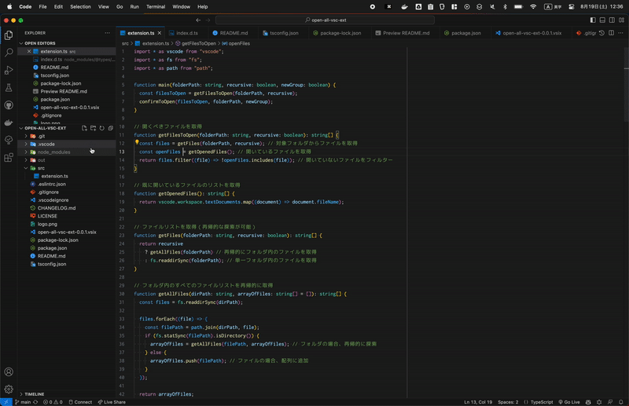

# 📂 open-all-vsc-ext拡張機能

VSCodeのエクスプローラーコンテキストメニューから、選択したフォルダ内のすべてのファイルを開く機能を提供する拡張機能です。

## この拡張機能を使うモチベーション
**[Github Copilotを賢くする](https://www.ai-native.dev/docs/v/ja/design-patterns/working-on-small-chunk#description)**

> GitHub Copilot の性能は、提供されるコンテキストに依存します。GitHub Copilot はテキストの類似性で開いているタブを検索し、大規模言語モデルにスニペットを送信します。したがって、私たちは AI に提供したいコンテキストを慎重に考える必要があります。プログラミングでは、宣言ファイル（d.ts）、テストファイル、インターフェイスファイルなどが豊富なコンテキスト情報を含んでいます。

## 🌟 主な機能
- 📄 選択したフォルダ内のすべてのファイルを開く
- 🔄 フォルダ内のすべてのファイルを再帰的に開く
- 📑 新しいエディターグループでファイルを開く

## 🚀 使い方
右クリックでフォルダを選択し、コンテキストメニューから「すべてのファイルを開く」を選択すると、そのフォルダ内のすべてのファイルが開きます。

## 📜 バージョン履歴

### バージョン 0.0.1
- 🎉 初回リリース
### バージョン 0.0.2
- 使い方動画追加
